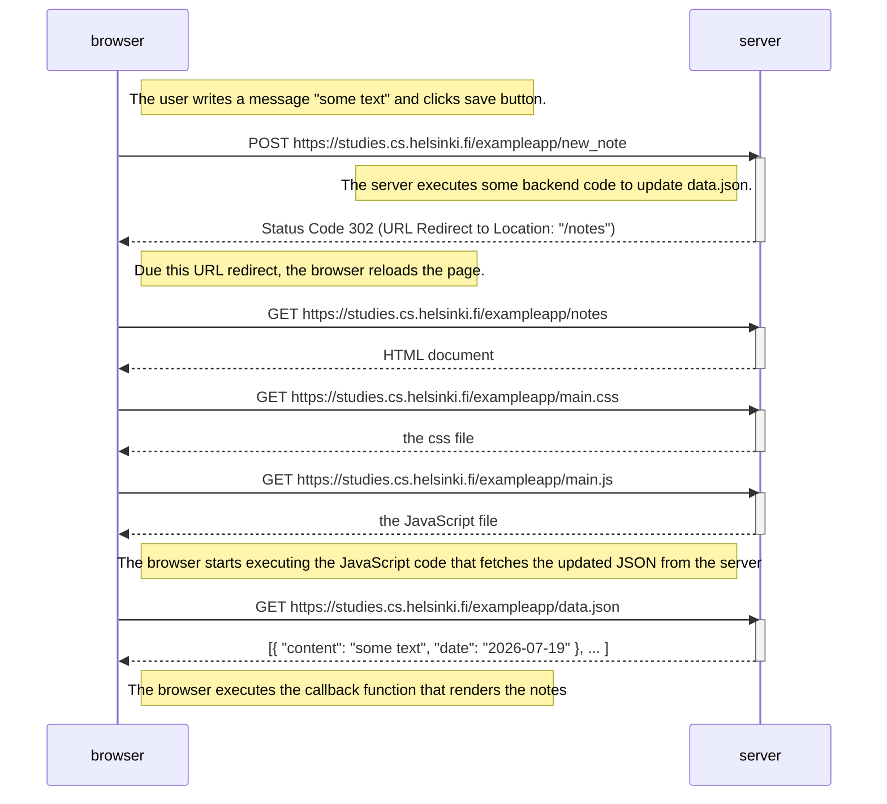

# Part 0, Exercise 0.4, New note diagram

```mermaid
sequenceDiagram
    participant browser
    participant server

    Note right of browser: The user writes a message "some text" and clicks save button.

    browser->>server: POST https://studies.cs.helsinki.fi/exampleapp/new_note
    activate server

    Note left of server: The server executes some backend code to update data.json.

    server-->>browser: Status Code 302 (URL Redirect to Location: "/notes")
    deactivate server

    Note right of browser: Due this URL redirect, the browser reloads the page.

    browser->>server: GET https://studies.cs.helsinki.fi/exampleapp/notes
    activate server
    server-->>browser: HTML document
    deactivate server

    browser->>server: GET https://studies.cs.helsinki.fi/exampleapp/main.css
    activate server
    server-->>browser: the css file
    deactivate server

    browser->>server: GET https://studies.cs.helsinki.fi/exampleapp/main.js
    activate server
    server-->>browser: the JavaScript file
    deactivate server

    Note right of browser: The browser starts executing the JavaScript code that fetches the updated JSON from the server

    browser->>server: GET https://studies.cs.helsinki.fi/exampleapp/data.json
    activate server
    server-->>browser: [{ "content": "some text", "date": "2026-07-19" }, ... ]
    deactivate server

    Note right of browser: The browser executes the callback function that renders the notes
```
